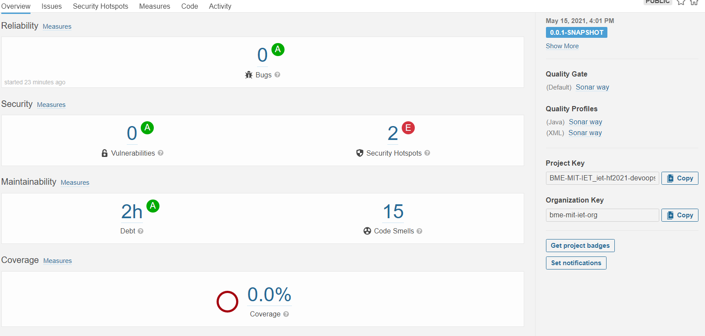

# Statikus kódanalízis Sonarqube használatával
Először a main ágon lévő kódot elemeztük SonarCloud-on keresztül. Az alábbi képen látható a kezdeti állapot.

## Code smells
- Charset helyett StandardCharset használata a karakterkódoláshoz.
- System.out és System.err módosítása logger-re a standard kimenetre való íráskor.
- Kivételdobásnál az általános Exception helyett konkrét típusok használata (pl.: IOException).
- Egy var nevű változó átnevezése, hiszen a var bizonyos esetekben kulcsszóként is értelmezhető.
- Egy osztály fejlécében a módosítók megfelelő sorrendbe állítása. (private static abstract class helyett private abstract static class)
- Két egymásba ágyazott Elvis operátor helyett if feltételek használata az átláthatóság miatt.
- A main fejlécéből kitöröltük a 'throws Exception'-t, mivel a függvény egy try-catch blokkban elkapja a kivételeket és nem dobja azokat tovább.

Az egyes code smellek javítása során újabb hibák jelentkeztek a kódban, amiket ugyanúgy meg kellett oldani. Ilyen volt például a sztringformázás során felmerülő probléma (sztringek összefűzése '+' jellel).

Az író, olvasó erőforrások lezárása nem történt meg Exception dobás esetén. Ezért ezeket egy try-with-resources blokkal kezeltük.
## Security Issues
- Sha1 helyett sha512 hash algoritmus használata a biztonság növelése érdekében.
- A kivételeknél a printStackTrace függvény meghívása helyett csak a hibaüzenet kiírása.

A feladat elvégzése során ezeket a hibákat javítottuk.