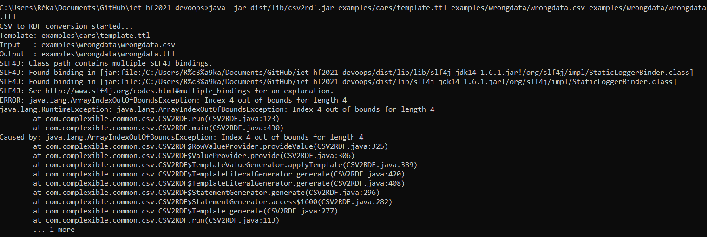
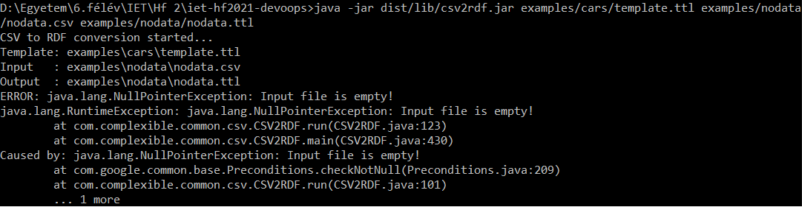

# Manuális tesztek

## Separator option
A csv szeparátorát ";"-vel teszteltük az alapértelmezett "," helyett. Ennek a fájljai az [alábbi mappában](../examples/separator) található. A program az elvárásoknak megfelelően működött. Létrehozta a [.ttl fájlt](../examples/separator/separator.ttl) a [.csv fájlból](../examples/separator/separator.csv).

## Escape option
A csv escape karakterét a default "\\" helyett "%"-kal teszteltük. A kapcsolódó fájlok az [alábbi mappában](../examples/escape) találhatók. A program helyesen lefutott. Létrejött a [.ttl fájl](../examples/escape/escape.ttl) a [.csv fájlból](../examples/escape/escape.csv).

## Quote option
A csv quote karakterét a kezdeti " helyett "+"-szal helyettesítettük. A kapcsolódó fájlok a [mappában](../examples/quote) találhatók. A program helyesen lefutott. Létrejött a [.ttl fájl](../examples/quote/quote.ttl) a [.csv fájlból](../examples/quote/quote.csv). Próbáltuk a "^" jellel is, de ezt a karaktert nem bírta feldolgozni, IllegalArgumentException keletkezett.
  
Az egymásba ágyazott "-ek más karakterrel való helyettesítése sem működött.

## No-header option
A no-header option kipróbálása során számos problémába ütköztünk. Az általunk kiadott parancs a leírásnak megfelelő volt, mégis minden esetben Exception-t kaptunk. A csv fájlt is többféleképpen módosítottuk (üres fejléc sor, kihagyott fejléc, csak vesszőkből álló sor), illetve a parancs kiadását is variáltuk, a [README.md](../README.md)-ben írt help parancs segítségével is értelmeztük.
A kód debugolása közben arra juttottunk, hogy a hiba abban a kódrészben keletkezik, ahol még nem ellenőrzi, hogy van-e header, illetve a --no-header option be van-e állítva. A fájlok [ebben a mappában](../examples/noheader) találhatók.

## Hibás adat tesztelése

A szándékosan hibás [csv fájl](../examples/wrongdata/wrongdata.csv) (hiányzó oszlopok az egyes rekordokban) esetén az elvárásoknak megfelelően ArrayIndexOutOfBoundsException-t kaptunk, de ennek ellenére létrejött az üres [kimeneti fájl](../examples/wrongdata/wrongdata.ttl). A fájlok [ebben a mappában](../examples/wrongdata) találhatók.

## Üres input fájl tesztelése

Üres [input fájl](../examples/nodata/nodata.csv) esetén a program felismeri és jelzi a felhasználónak a problémát. A nullpointer exception mellett konkrét szöveges visszajelzést is kap a felhasználó. Ebben az esetben .ttl fájl sem készül. A kapcsolódó fájlok [ebben a mappában](../examples/nodata) találhatók.

## Rossz formátumú adat

Ha az egyik szám érték helyett (amit dátumba helyettesít be) szöveget írunk be, azt nem detektálja. Az alább látható módon behelyettesíti a dátum helyére. Inputként ezt a [.csv](../examples/wrongFormat/wrongFormat.csv) fájlt használtuk.   
